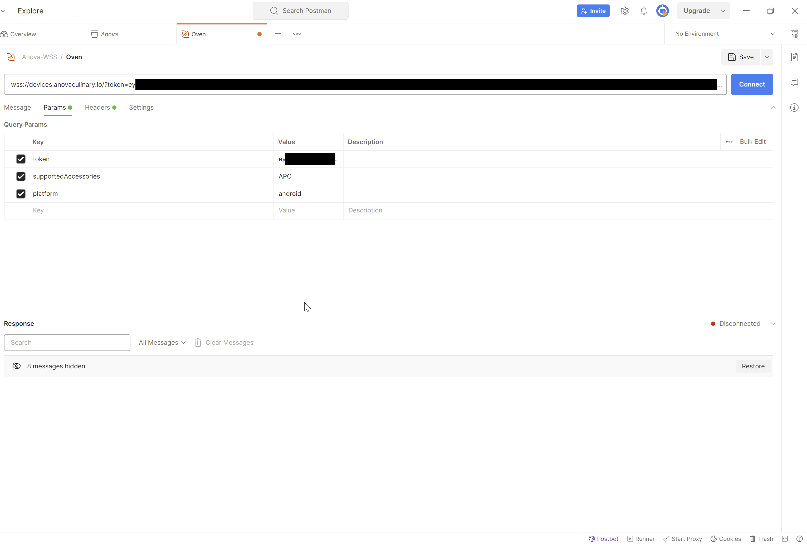
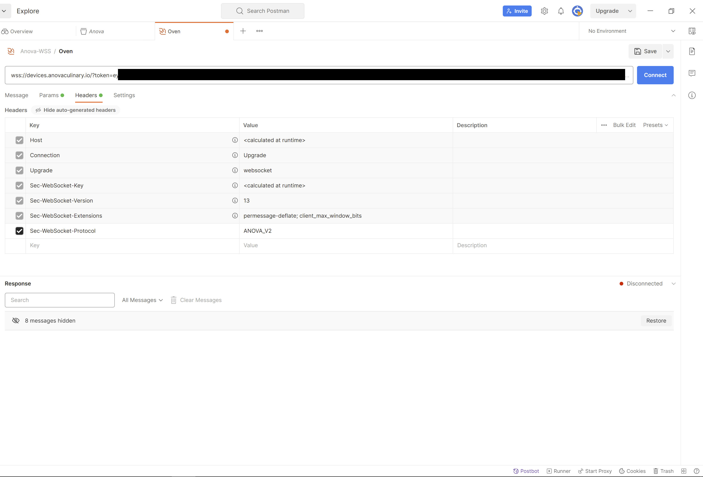
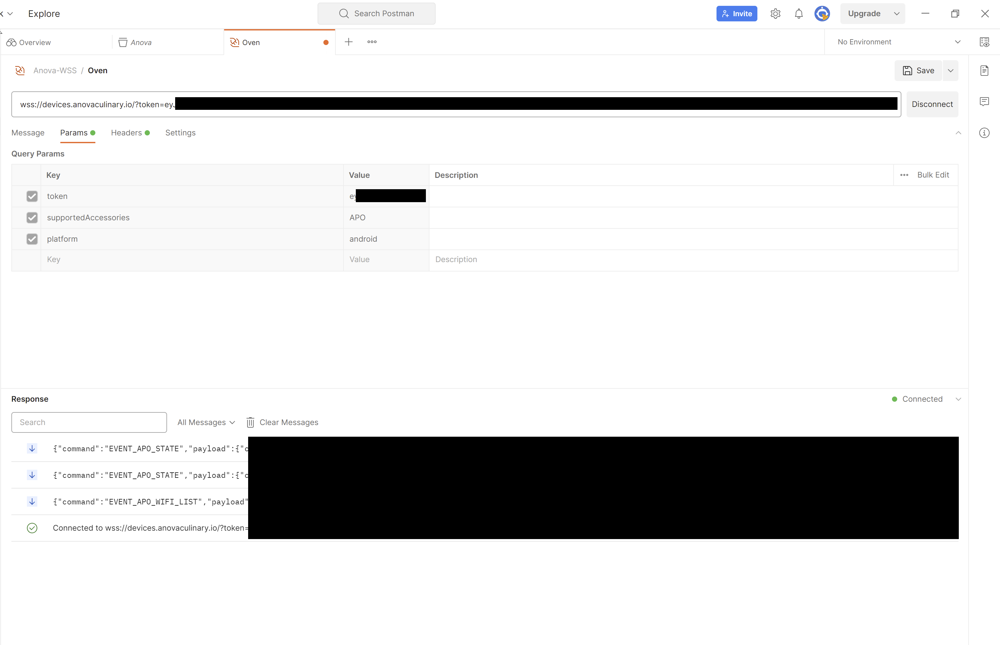

# Anova Precision Oven API

## Introduction

Before we start - a big FU to Anova! After [many years](https://community.anovaculinary.com/t/api-in-2021) of people in the community asking for an open API, or some way, any way, of interacting with their products in an open way, they still will not provide that. In fact, they repeatedly took active action to prevent people from doing this (changing authentication mechanisms, undocumented [API changes](https://anovaculinary.com/pages/software-updates), or [telling people that "they are working on a public API"](https://github.com/bmedicke/anova.py/issues/1) and instead implementing certificate pinning, etc). 

In fact, no - let me rephrase this. This is not directed to all the people at Anova. I am sure they have plenty of good people, working to create good products. And they do make quality products to prove that. This is just for the few people in charge who just don't understand that allowing customers to actually interact with their products in an open way would in no way hurt the company or their market. In fact, it would actually be beneficial for everyone, making possible new use cases.

Most people asking for an API are (just like me) huge fans of Anova and their products, looking for a way to actually extend the functionality of those products. Too bad Anova doesn't seem to understand that...

Rant over, back to the docs.

## Disclaimer

This project is in no way affiliated with Anova. Anything you find here is just based on whatever public information I was able to gather. And if the past is any guide, things can (and will) change based on Anova's whims. 

Use this at your own risk.

## Acknowledgements 

Some useful links I used when putting this together:
* [API decoding](https://mcolyer.github.io/anova-oven-api/#introduction) by mcolyer. Unfortunately, this is for the v1 API, which was deprecated by Anova in August 2022
* [Anova oven forwarder](https://github.com/huangyq23/anova-oven-forwarder) by huangyq23 . The project that got me started in the right direction for the v2 API. Also, a great project for anyone looking to collect data from the oven, and even get a nice Grafana dashboard with the various oven parameters. Unfortunately, I was unable to get in touch with the creator - he/she does not respond to issues, and the discord invite in the repo does not work :(
* [The discussion](https://community.home-assistant.io/t/anova-precision-oven/541722) that got this project started. Hopefully, in the future, the information I post here will help someone write an actual Home Assistant integration for the oven
* [The request](https://community.anovaculinary.com/t/api-in-2021) for a public API. Maybe one day this will be available, and my repo will become obsolete. Just don't hold your breath...

## Using the API

### General information

There are many places where the requests use UUIDs. As far as I was able to tell, you could place pretty much anything there, and it will work. The recommended way is to use version 4 UUIDs - you can generate them for example [here](https://www.uuidgenerator.net/).

### Getting the refresh token

The actual application runs on Firebase, and authenticates via Google's Identity Platform (OAuth, I believe?). So you will need either an access token (which has a limited lifetime before it expires), or the refresh token (which you can exchange for a new access token whenever needed).

1. Using Chrome, connect to [https://oven.anovaculinary.com](https://oven.anovaculinary.com) . Authenticate using whatever mechanism you normally use. 
2. Press F12, and go to `Application > Storage > IndexedDB > firebaseLocalStorageDB > firebaseLocalStorage > value > stsTokenManager > refreshToken`
3. If you are able to copy/paste that token, great! In my case, Chrome did not allow that, so I had to install a third-party extension (IndexedDBEdit). This adds a new tab under F12, so you can easily go to `F12 > IndexedDBEdit > firebaseLocalStorageDB > firebaseLocalStorage` and get the `refreshToken` value from the JSON.
4. While you are here, also get the apiKey (it should be the same one for everyone)

### Getting the access token
You could get the access token directly from the IndexedDB, but (as mentioned above) it will expire in a short time. If you have the refresh token, you can exchange it for a new access token whenever you wish, as described in [Google's docs](https://cloud.google.com/identity-platform/docs/use-rest-api). I am using `curl` here as an example:

```
curl 'https://securetoken.googleapis.com/v1/token?key=<API_KEY>' \
    -H 'Content-Type: application/x-www-form-urlencoded' \
    --data 'grant_type=refresh_token&refresh_token=<REFRESH_TOKEN>'
```

Replace `API_KEY` and `REFRESH_TOKEN` with the values you got in the previous step.

You will get a JSON as a result. Copy the value for `id_token` - this is the one you will need later.

### Connecting to the API

The API runs on `wss://app.oven.anovaculinary.io` . You will need to connect to it using a client that supports WebSockets - either postman or an online tool like [this one](https://www.piesocket.com/websocket-tester).

Before connecting, you will need to set the following:
1. Query parameters:
* token: the access token (`id_token`) you got in the previous step
* supportedAccessories: APO
* platform: ios (you can also use `android` as a value, if you prefer :) )
2. Headers:
* add a header called `Sec-WebSocket-Protocol`, with a value of `ANOVA_V2`

Examples:






### Getting information

Once connected, you should start to receive `EVENT_APO_STATE` messages. They are received periodically, about every 30 seconds.



Look for `cookerId` in the received messages - that is your device (oven) ID, and you will need that when sending commands to it!

### Sending commands

To tell the oven what to do, you need to send a JSON-formatted message over the connection. Make sure to place your own oven ID (collected in the previous section) under `id`!

As mentioned above, whenever the command needs a UUID, you can write your own, or you can [generate](https://www.uuidgenerator.net/) one.

Example commands: 
#### Stop cook

Syntax:

```
{
  "command": "CMD_APO_STOP", 
  "payload": {
    "type": "CMD_APO_STOP",
	"id": "<your_oven_id>"
  },
  "requestId": "<uuid>"
}
```

Example:
```
{
  "command": "CMD_APO_STOP", 
  "payload": {
    "type": "CMD_APO_STOP",
	"id": "0123456789abcdef"
  },
  "requestId": "1eddc2c8-d1f1-446b-b76d-334221134"
}
```

#### Start cook

Syntax:
```
{
  "command": "CMD_APO_START",
  "payload": {
    "payload": {
      "cookId": "android-<uuid>",
      "stages": [
        <stage_list>
      ]
    },
    "type": "CMD_APO_START",
    "id": "<your_oven_id>"
  },
  "requestId": "<uuid>"
}  
```

Example of a multistage cook. Notice that a stage with a timer is actually represented by two stages in the JSON (pretty much similar to the way you build stages in the app) - probably to allow for the "start timer after preheat" option.

```
{
  "command": "CMD_APO_START",
  "payload": {
    "payload": {
      "cookId": "android-8abff358-d7c8-4694-bd90-54344563afe5",
      "stages": [
        {
          "stepType": "stage",
          "id": "android-1b7dbdd2-dd07-4f9c-95d1-76c5aea20c60",
          "title": "First stage",
          "description": "",
          "type": "preheat",
          "userActionRequired": false,
          "temperatureBulbs": {
            "dry": {
              "setpoint": {
                "fahrenheit": 410,
                "celsius": 210
              }
            },
            "mode": "dry"
          },
          "heatingElements": {
            "bottom": {
              "on": false
            },
            "top": {
              "on": false
            },
            "rear": {
              "on": true
            }
          },
          "fan": {
            "speed": 100
          },
          "vent": {
            "open": false
          },
          "rackPosition": 3
        },
        {
          "stepType": "stage",
          "id": "android-a9523efb-3590-4f74-979a-ca28f79e0b9a",
          "title": "",
          "description": "",
          "type": "cook",
          "userActionRequired": false,
          "temperatureBulbs": {
            "dry": {
              "setpoint": {
                "fahrenheit": 410,
                "celsius": 210
              }
            },
            "mode": "dry"
          },
          "heatingElements": {
            "bottom": {
              "on": false
            },
            "top": {
              "on": false
            },
            "rear": {
              "on": true
            }
          },
          "fan": {
            "speed": 100
          },
          "vent": {
            "open": false
          },
          "rackPosition": 3,
          "timerAdded": true,
          "probeAdded": false,
          "timer": {
            "initial": 1800
          }
        },
        {
          "stepType": "stage",
          "id": "android-1e8b7543-0661-4956-9c78-cad63481bec9",
          "title": "Stage 2, low temp",
          "description": "",
          "type": "preheat",
          "userActionRequired": true,
          "temperatureBulbs": {
            "dry": {
              "setpoint": {
                "fahrenheit": 338,
                "celsius": 170
              }
            },
            "mode": "dry"
          },
          "heatingElements": {
            "bottom": {
              "on": false
            },
            "top": {
              "on": false
            },
            "rear": {
              "on": true
            }
          },
          "fan": {
            "speed": 100
          },
          "vent": {
            "open": false
          },
          "rackPosition": 3,
          "steamGenerators": {
            "steamPercentage": {
              "setpoint": 100
            },
            "mode": "steam-percentage"
          }
        },
        {
          "stepType": "stage",
          "id": "android-a002ed0f-f049-4a61-b466-1ecda24c26a7",
          "title": "",
          "description": "",
          "type": "cook",
          "userActionRequired": false,
          "temperatureBulbs": {
            "dry": {
              "setpoint": {
                "fahrenheit": 338,
                "celsius": 170
              }
            },
            "mode": "dry"
          },
          "heatingElements": {
            "bottom": {
              "on": false
            },
            "top": {
              "on": false
            },
            "rear": {
              "on": true
            }
          },
          "fan": {
            "speed": 100
          },
          "vent": {
            "open": false
          },
          "rackPosition": 1,
          "timerAdded": true,
          "probeAdded": false,
          "steamGenerators": {
            "steamPercentage": {
              "setpoint": 100
            },
            "mode": "steam-percentage"
          },
          "timer": {
            "initial": 1800
          }
        },
        {
          "stepType": "stage",
          "id": "android-142dff25-ec02-4c8b-86fd-5a10191735ec",
          "title": "stage 3, higher temperature",
          "description": "",
          "type": "preheat",
          "userActionRequired": false,
          "temperatureBulbs": {
            "dry": {
              "setpoint": {
                "fahrenheit": 410,
                "celsius": 210
              }
            },
            "mode": "dry"
          },
          "heatingElements": {
            "bottom": {
              "on": false
            },
            "top": {
              "on": false
            },
            "rear": {
              "on": true
            }
          },
          "fan": {
            "speed": 100
          },
          "vent": {
            "open": false
          },
          "rackPosition": 3
        },
        {
          "stepType": "stage",
          "id": "android-b849c0b3-d469-4317-adc6-b9a70906e0a6",
          "title": "",
          "description": "",
          "type": "cook",
          "userActionRequired": false,
          "temperatureBulbs": {
            "dry": {
              "setpoint": {
                "fahrenheit": 410,
                "celsius": 210
              }
            },
            "mode": "dry"
          },
          "heatingElements": {
            "bottom": {
              "on": false
            },
            "top": {
              "on": false
            },
            "rear": {
              "on": true
            }
          },
          "fan": {
            "speed": 100
          },
          "vent": {
            "open": false
          },
          "rackPosition": 3,
          "timerAdded": true,
          "probeAdded": false,
          "timer": {
            "initial": 600
          }
        }
      ]
    },
    "type": "CMD_APO_START",
    "id": "0123456789abcdef"
  },
  "requestId": "afa291d8-3519-4b8a-850b-776bf8286816"
}  
```
